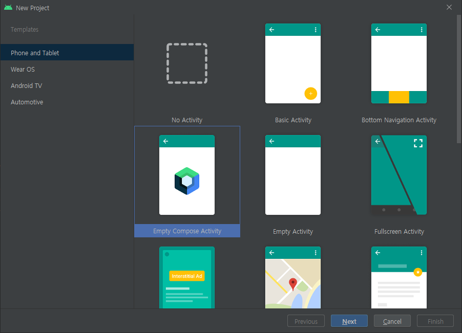
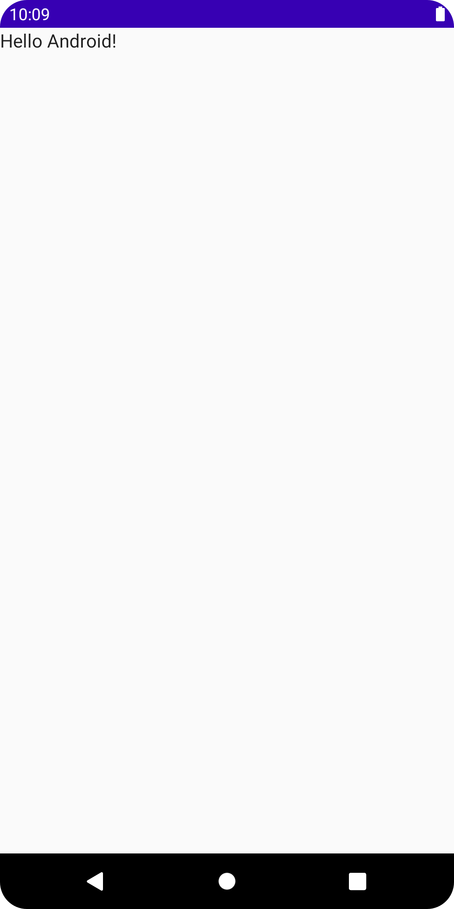

# Jetpack Compose
<a href="https://haneul.oopy.io/jetpackcompose" target="_blank"></a>
> Kotlin으로 UI를 만들 수 있는 라이브러리


<br><br>


## 개발환경 설정  
-----
<br><br>
### Android Studio 기본 제공 설정
> 가장 편한 세팅 방법 - Android Studio, Jetpack 버전에 신경쓸 필요 없음

* New Project 생성 / Empty Compose Activity 선택



* Android에서 제공하는 기본 코드
```Kotlin
package com.cloud.calling
...

class MainActivity : ComponentActivity() {
    override fun onCreate(savedInstanceState: Bundle?) {
        super.onCreate(savedInstanceState)
        setContent {
            CallingTheme {
                // A surface container using the 'background' color from the theme
                Surface(
                    modifier = Modifier.fillMaxSize(),
                    color = MaterialTheme.colors.background
                ) {
                    Greeting("Android")
                }
            }
        }
    }
}

@Composable
fun Greeting(name: String) {
    Text(text = "Hello $name!")
}

@Preview(showBackground = true)
@Composable
fun DefaultPreview() {
    CallingTheme {
        Greeting("Android")
    }
}
```
* 결과 화면




<br><br>


### 직접 Gradle 설정
> Android Studio과 Jetpack버전에 따라 코드가 자주 변경되는 점 주의

* `Android Studio`버전에 맞는 `Android Gradle plugin`확인
```C
buildscript {
    ...
    dependencies {
        classpath "com.android.tools.build:gradle:7.0.0"
        ...
    }
}
```
* Kotlin 버전 `1.6.10`
```C
plugins {
    id 'kotlin-android'
}
```
* Gradle
```C
android {
    defaultConfig {
        ...
		//최소 API 수준 21
        minSdkVersion 21  
    }

    buildFeatures {
        // Jetpack Compose 사용 설정
        compose true
    }
    ...
    compileOptions {
        sourceCompatibility JavaVersion.VERSION_1_8
        targetCompatibility JavaVersion.VERSION_1_8
    }
    kotlinOptions {
		//Kotlin컴파일러 플러그인 버전 설정
        jvmTarget = "1.8"
    }

    composeOptions {
        kotlinCompilerExtensionVersion '1.1.1'
    }
}
```
* Gradle 종속 항목
```C
dependencies {
    // Integration with activities
    implementation 'androidx.activity:activity-compose:1.4.0'
    // Compose Material Design
    implementation 'androidx.compose.material:material:1.1.1'
    // Animations
    implementation 'androidx.compose.animation:animation:1.1.1'
    // Tooling support (Previews, etc.)
    implementation 'androidx.compose.ui:ui-tooling:1.1.1'
    // Integration with ViewModels
    implementation 'androidx.lifecycle:lifecycle-viewmodel-compose:2.4.1'
    // UI Tests
    androidTestImplementation 'androidx.compose.ui:ui-test-junit4:1.1.1'
}
```