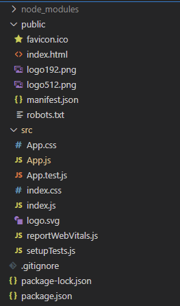

# React 기본 동작원리

## 프로젝트 구조
----

[react 시작하기](./getting-start.md) 
위 내용에 따라서 프로젝트를 생성하면, 기본적으로 다음과 같은 프로젝트 구조가 만들어진다.

 

  

## 렌더링 과정
---

``'src/index.js'`` 파일이 ``'src/App.js'``의 내용(return값)을 ``'public/index.html'``에 포함하도록 요청한다.

실제로 렌더링되는 것은 ``'public/index.html'``이다.

개발은 ``'src/App.js'``에 html코드를 작성하는데, 형태는 HTML이지만 JS와 예약어가 충돌하는 것을 방지하는 ``JSX`` 코드이다.
> 예시로 HTML 태그의 class와 JS의 class가 겹치기 때문에 JSX에서는 태그에 className을 사용한다. 

